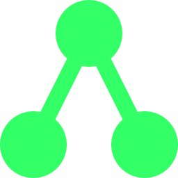

<p align="center">
  
</p>

<h1 align="center">Mazocarta</h1>

<p align="center">
  <a href="https://www.mazocarta.com">
    
  </a>
  <a href="https://www.mazocarta.com/preview/">
    
  </a>
  <a href="https://github.com/timcogan/mazocarta/actions/workflows/pages.yml">
    
  </a>
  <a href="LICENSE">
    
  </a>
  <a href="https://github.com/timcogan/mazocarta/releases">
    
  </a>
</p>

A browser-first tactical card game written in Rust and compiled to WASM.

## Current Scope

- A full run structure across 3 sectors with branching map progression
- Deterministic combat with visible enemy intents, statuses, modules, and consumables
- Combat, elite, boss, rest, shop, and event nodes
- English and Spanish UI
- An installable web client with offline support after the first online load
- Mouse, keyboard, and touch support through Pointer Events

## Development Flow

1. Install the WASM target:

```bash
rustup target add wasm32-unknown-unknown
```

2. Run the Rust tests:

```bash
cargo test
```

3. Run the pre-publish validation pass:

```bash
make publish-check
```

4. Build the `.wasm` bundle, refresh generated QR assets, and refresh the web host:

```bash
make build
```

5. Serve the `web/` directory:

```bash
make serve
```

6. Open `http://localhost:4173`.

## Android CLI Wrapper

Mazocarta now includes a CLI-only Android wrapper project in `android/`. It packages the built `web/` client into a native `WebView` app, so you do not need Android Studio GUI to run it on a phone.

Prerequisites:

- Java 17+ installed
- `adb` available
- Android SDK command-line tools

CLI flow:

```bash
make android-setup-sdk   # optional, installs SDK into ./.android-sdk
make android-install
make android-run
```

What those do:

- `make build` compiles the WASM bundle
- `make android-sync` copies `web/` into Android app assets
- `make android-build` assembles the debug APK
- `make android-install` installs it to a connected device
- `make android-run` launches it with `adb`

The Android wrapper loads the app from packaged assets inside `WebView`, not from a real `localhost` server on the phone.

## Multiplayer LAN Testing

Automated local validation:

```bash
make test-e2e
```

This includes a two-browser host/guest LAN session test that pairs by code, starts a run, and verifies guest map spectating behavior.

For repeated gameplay freeze/stall detection on a real host/guest session path, run the soak runner:

```bash
npm run soak:2p -- --runs 5 --seed-start 1
```

It pairs two browser pages by code, starts deterministic 2-player runs, autoplays both sides, and reports the first seed that stalls. A `progress_timeout` means the run budget elapsed while the session was still making progress; pass `--fail-on-timeout` when you want that to fail CI.

Manual two-device validation:

1. Run `make build` and `make serve`.
2. Open the app on two devices on the same local network.
3. On the host device, open `Multiplayer -> Host`.
4. On the guest device, open `Multiplayer -> Join` and use `Paste code` if camera scanning is unavailable.
5. Complete host-offer -> guest-confirm pairing, start the run, then verify both devices see the same map while only the host can choose the next node.

## Balance Simulation

Run the native actor to simulate many runs and print aggregate difficulty stats:

```bash
cargo run --bin actor -- --runs 1000 --seed-start 1
```

Use `--verbose` to print one line per simulated run before the final summary.

For 2-player balance and survival stats, use:

```bash
cargo run --bin actor -- --players 2 --runs 1000 --seed-start 1
```

## Controls

- `Click` or `tap` to select the active card, option, or map node
- `1`-`9` selects visible cards, rewards, nodes, or other numbered options depending on the screen
- `Enter` or `Space` advances the primary action on the current screen, including ending the turn in combat
- `Esc` clears combat selection, closes overlays, or returns to the title screen depending on context
- `S` opens title-screen settings
- `I` triggers title-screen install when the host supports it

## Layout

- `src/combat.rs`: combat rules and tests
- `src/app.rs`: app state, layout, input, and frame serialization
- `src/content.rs`: cards, modules, enemies, and event content
- `src/dungeon.rs`: run progression and node generation
- `web/`: static browser shell and PWA host
